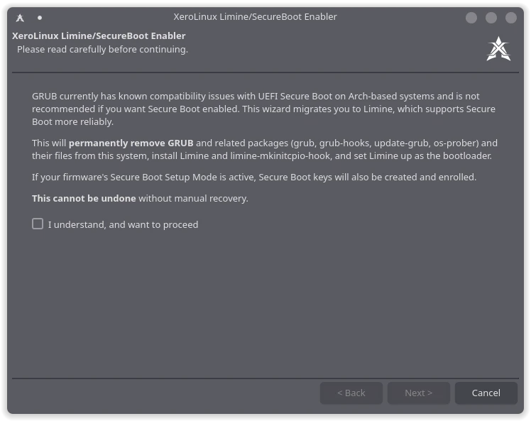

# XeroLinux Limine/SecureBoot Enabler

A guided GUI that migrates an installed **XeroLinux** system from **[GRUB](https://git.savannah.gnu.org/cgit/grub.git/)** to **[Limine](https://github.com/limine-bootloader/limine)** and enables **Secure Boot** Support via `sbctl`.

<div align="center">



</div>

## ⚠️ Use At Your Own Risk

This tool replaces your bootloader and changes Secure Boot enrollment at the firmware
level. Turn Secure Boot off and clear any existing keys before proceeding. If
interrupted or misconfigured, your system can become unbootable and may need manual
recovery from a live USB. **Backups are strongly recommended.**

## Features

- Applies a XeroLinux boot splash wallpaper to the **[Limine](https://github.com/limine-bootloader/limine)** menu
- Migrates an installed XeroLinux system from **[GRUB](https://git.savannah.gnu.org/cgit/grub.git/)** to **[Limine](https://github.com/limine-bootloader/limine)**, in a single guided wizard
- Detects other installed operating systems and preserves dual-boot via **[Limine](https://github.com/limine-bootloader/limine)** chainload entries
- Detects UEFI, GPT, and LUKS root (including LVM-on-LUKS), carrying over your **[GRUB](https://git.savannah.gnu.org/cgit/grub.git/)** kernel parameters
- Refuses to remove **[GRUB](https://git.savannah.gnu.org/cgit/grub.git/)** until **[Limine](https://github.com/limine-bootloader/limine)** is verified working, and refuses to migrate while Secure Boot is already on
- Every step runs through a single root-privileged helper (`xsb-helper`) via `pkexec`, with live progress shown in the GUI
- Enables Secure Boot via `sbctl`: creates, enrolls, and signs keys for **[Limine](https://github.com/limine-bootloader/limine)** and your kernels, with known board quirks handled

## Requirements

- An installed **XeroLinux** system, booted in **UEFI** mode with a GPT partition table

## Installation

Install from the XeroLinux repositories:

```bash
sudo pacman -S xsb-gui
```

## Usage

Launch from your application launcher ("Limine/SecureBoot Enabler"). The wizard walks you through pre-flight checks, a summary of what will happen, the **[GRUB](https://git.savannah.gnu.org/cgit/grub.git/)**-to-**[Limine](https://github.com/limine-bootloader/limine)** migration itself, and Secure Boot enrollment, in that order.

## License

GPL-3.0-or-later. See [LICENSE](LICENSE).
